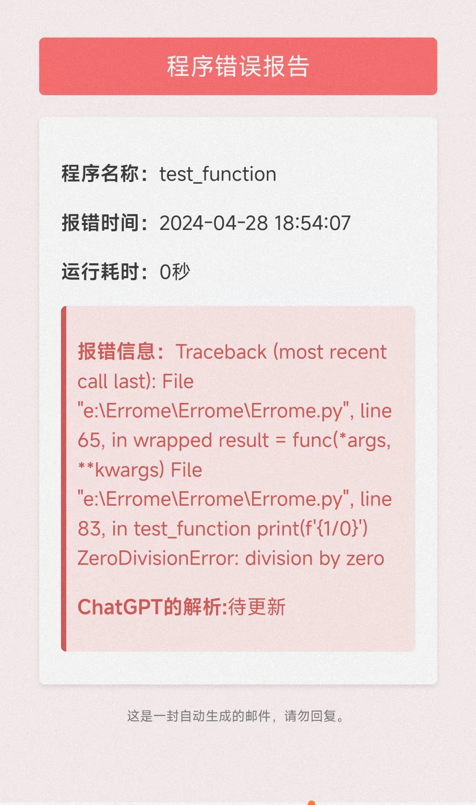

<h1 align="center">
  <br>
  📧 Errome
  <br>
</h1>

<p align="center">
  <i>高效、简单的Python程序监控方案</i>
</p>

<hr>

Errome 是一个 Python 库，旨在为 Python 应用程序提供一个简单的方式来发送运行状态通知邮件。无论程序运行成功或遇到错误，Errome 都能自动发送包含运行时间和错误信息（如有）的邮件给指定的接收者。
使用的时候，将你的所有主程序包装到一个def中，然后你只需要一行代码即可完成对你的程序的监控😁

**使用场景：① Tmux 后台运行的程序 ;② 长时间运行的程序**

## Update

- 2024.07.29 更新：
  - 支持更多邮箱及自定义邮箱 (支持大部分商用邮箱，如163，qq，outlook，gmail等，但不支持使用非465端口的服务商)
  - 支持自定义SMTP服务器
  - 优化了类的调用逻辑
  - 增加了一个简单调用方法，但是记住这可能并不是一个好的方法。
  - 加入更加精简的调用方法**ERM.notify(recever)**
- 之后应该不会再进行功能性更新，只修复bug

## 功能

- 监控函数的执行时间
- 在函数成功执行后发送运行成功的邮件通知
- 捕获函数运行时的异常，并发送包含错误信息的邮件通知

## 图示：



报错图示

## 安装

1.通过克隆 GitHub 仓库的方式安装 Errome：

```bash
git clone https://github.com/Becomingw/Errome.git
cd Errome
pip install .
```
2.通过pip安装：
```bash
pip install Errome
```
3.更新Errome：
```bash
pip install --upgrade Errome
```
## 使用

在 Python 文件中导入 Errome 库：

```python
from Errome import Errome
```

## 快速开始

首先，确保你有一个可以发送邮件的 SMTP 服务器。目前~~仅支持smtp.163.com(网易邮箱)~~。最新版本已支持大部分商用邮箱，如163，qq，outlook，gmail等，但不支持使用非465端口的服务商。

### One Raw is All You Need in your code to add Errome 🤗

```python
from Errome import ERM

@ERM.notify(recever="receiver_email@example.com")
def test_function():
  ### 以下是你的主程序，比如一个爬虫，一个训练模型，一个数据处理过程
    print("This is your main program")

test_function()
```

### 其他更Sample的使用方法 🤭
创建一个 Errome 实例：

```python
from Errome import Errome
#### 初始化邮件发送器
email_sender = Errome(sender_email="your_email@163.com",
                    password="your_password",
                    receiver="receiver_email@example.com")
```

为了更加简易得使用，提供了一个ERM类，它使用我的自建域名邮箱来发送信息，不保证隐私性，但足够简单易用。可以创建一个ERM类：

```python
from Errome import ERM
email_sender = ERM(recever="receiver_email@example.com")
```

使用 @email_sender.notify 装饰器来监控你的函数：

```python
@email_sender.notify
def my_function():
    # Your function code here
    print("This function does something.")
```

运行你的函数：

```python
my_function()
```

当 my_function 执行完成，你会收到一封邮件通知。如果函数执行过程中出现异常，邮件中将包含错误信息。

也可以不使用修饰器，

在一段程序开始运行时：

```python
email_sender.set_start()
```

然后后续使用email_sender.send_email（statu）来发送邮件。这里的statu可设置为"ok"或其他的str,"ok"时发送运行成功的邮件，不为"ok"时发送运行错误的邮件。在notify中，的做法是使用try-except来判断是否运行成功，并使用traceback.format_exc()来获取错误信息，将错误信息传入statu。
**🚨 <span style="color: red;">因此，如果的项目具有隐秘必要，尤其是服务器项目时，不建议使用ERM，而是使用Errome来监控你的程序，甚至必要时使用自建域名邮箱</span>**

## 配置

- **sender_email**: 发件人邮箱地址。
- **password**: 发件人邮箱的密码或应用密码(具体来说是邮箱的secret_token)。
- **recever**: 邮件接收者的邮箱地址。
- 相关介绍：[QQ邮箱SMTP设置](https://service.mail.qq.com/detail?search=POP3/SMTP%E6%9C%8D%E5%8A%A1)

### To DO:

- 接入GPT对错误信息进行解释(暂时不会接入)
- 完善方法使用文档

